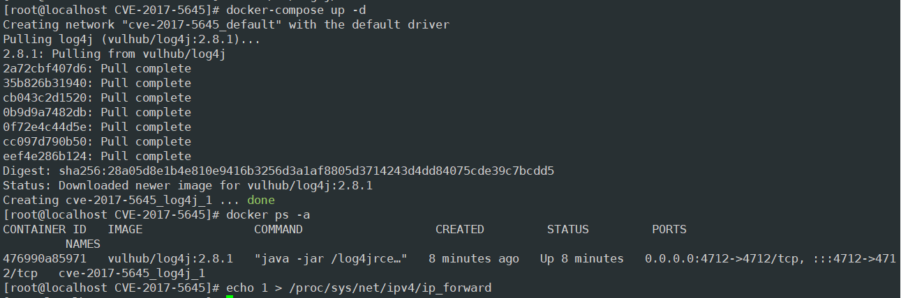

# Log4j-反序列化命令执行（CVE-2017-5645）

### 0x00 前言

Apache Log4j是一个用于Java的日志记录库，其支持启动远程日志服务器。Apache Log4j 2.8.2之前的2.x版本中存在安全漏洞。攻击者可利用该漏洞执行任意代码。

受影响版本：

> Apache Log4j 2.8.2之前的2.x版本

### 0x01 环境搭建

使用vulhub搭建环境

### 0x02 漏洞复现