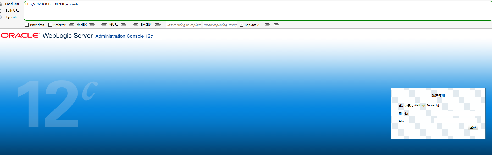

# WebLogic-远程代码执行漏洞复现 （CVE-2023-21839）

### 0x00 前言

WebLogic存在远程代码执行漏洞，该漏洞允许未经身份验证的远程攻击者通过T3/IIOP协议网络访问并破坏易受攻击的WebLogic服务器，成功利用此漏洞可能导致Oracle WebLogic服务器被接管或敏感信息泄露。

影响范围：

```
Oracle WebLogic Server 12.2.1.3.0
Oracle WebLogic Server 12.2.1.4.0
Oracle WebLogic Server 14.1.1.0.0
```

### 0x01 环境搭建

这里是用的vulhub进行环境搭建



### 0x02 复现步骤

1、


### 0x03 修复建议

1、更新Oracle官方发布的最新补丁