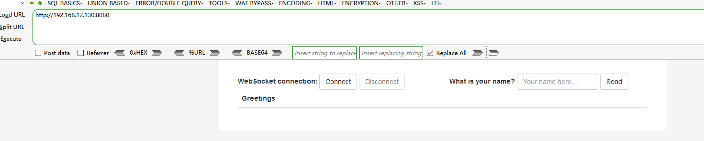

# Spring Cloud Gateway-远程代码执行漏洞（CVE-2022-22947）

### 0x00 前言

Spring Cloud Gateway是Spring中的一个API网关。其3.1.0及3.0.6版本（包含）以前存在一处SpEL表达式注入漏洞，当攻击者可以访问Actuator API的情况下，将可以利用该漏洞执行任意命令。

**影响版本：**

```
Spring Cloud Gateway（3.1.x）< 3.1.1
Spring Cloud Gateway （3.0.x）< 3.0.7
Spring Cloud Gateway 其他已不再更新的版本
```

### 0x01 环境搭建

这里使用vulhub漏洞靶场

```shell
cd /opt/vulhub/spring/CVE-2022-22947
docker-compose up -d
```

访问`http://your_ip:8080`

